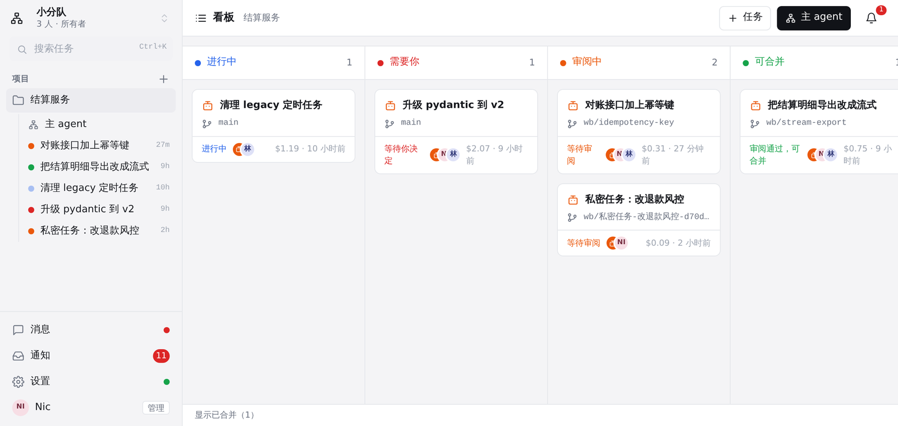
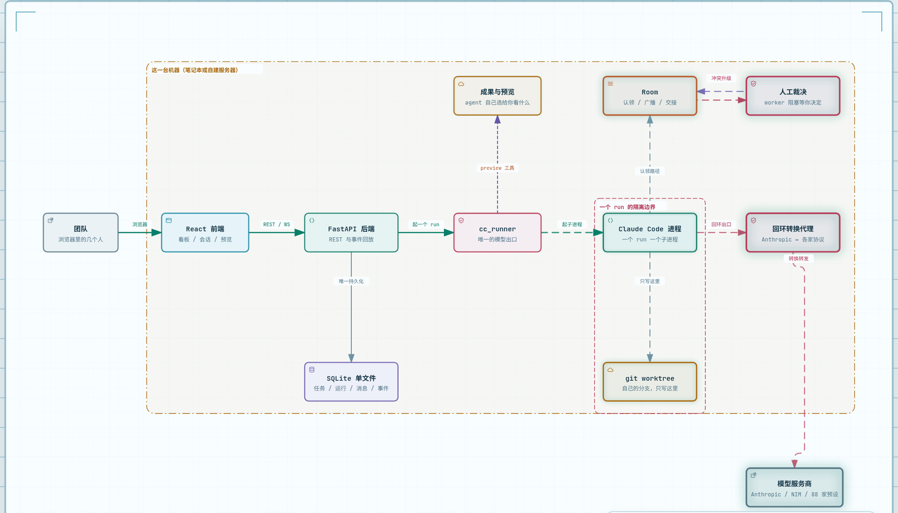

# Cloud Workbench

[](https://github.com/WangChangxin0809/ruchacthon/actions/workflows/ci.yml)
[](LICENSE)

部署在你自己服务器上的多 agent 开发工作台：一个团队在浏览器里派活、审阅、合并，
每个 agent 是服务器上一个独立的 Claude Code 进程，跑在自己的 git worktree 分支上。



## 它解决什么

派活是简单的部分。难的是三种交流同时发生——人跟人、agent 跟 agent、人跟 agent——
而大多数工具只做了第一种或第三种。

开五个终端跑五个 agent，你会立刻失去三样东西：不知道谁正在改哪个文件；看不到它究竟
交出了什么，只能翻滚屏；想让它改一处，只能把上下文重新描述一遍。把它们接进同一个群，
又会撞上第二组问题：谁该听见谁说话？一个 agent 能不能读别人的会话？两个 agent 要改
同一个文件，谈不拢谁拍板？

工作台把这三条通路做成同一套东西——同一份成员关系、同一条带序号的事件日志、同一个
收件箱——并且对上面每个问题都给出确定的答案，而不是交给模型自己商量：

| 通路 | 在哪里 | 规则 |
|---|---|---|
| 人 ↔ 人 | 消息区（私聊 / 群聊 / 会话成员） | 默认没有模型在听，`@` 点名才叫得动 agent |
| agent ↔ agent | Room（认领、广播、交接、点名） | 能找谁跟着派它的人走，越界返回 `refused:` 并说明原因 |
| 人 ↔ agent | 会话 + 检查器 | agent 主动提问和交成果，反馈回流到同一个会话 |

三条通路在冲突上汇合：同一个工作区抢同一个路径，**不自动裁决**，升级成一条待你决定的
记录，请求方就地阻塞直到你点。这条是架构不变量第 1 条，CI 里有一个 gate 盯着它。

## 架构

<picture>
  <source media="(prefers-color-scheme: dark)" srcset="docs/generated/architecture-dark.png">
  
</picture>

一条竖线是一个 run 的隔离边界：`cc_runner` 是唯一起模型的地方，每个 run 拿到自己的
worktree、自己的会话、自己的凭据快照。带三个演示视角的交互版在
[`docs/generated/architecture.html`](docs/generated/architecture.html)（用浏览器打开，
不用起服务），图的源是 [`architecture.archify.json`](docs/reference/architecture-diagram.md)。

## 快速开始

### 部署给团队用（一个进程，一个端口）

后端同时提供 API 和构建好的前端。

```bash
python3 -m pip install -r backend/requirements.txt
cd frontend && npm install && npm run build && cd ..
WORKBENCH_TOKEN=<自己想一个> python3 -m uvicorn app.main:app --app-dir backend --host 0.0.0.0 --port 8787
```

浏览 `http://<你的服务器>:8787/?token=<WORKBENCH_TOKEN>`。**第一个账号需要这个令牌**——
机器一重启就可达，没有这道门，第一个找到端口的陌生人就会成为管理员。第一个注册的人
成为管理员并拥有「默认团队」，其他人通过 ⚙ → 团队 里的邀请链接加入。

服务还需要一次 Claude Code 登录才能真正跑 agent：在服务器上把 `CLAUDE_CODE_OAUTH_TOKEN`
写进环境，或者以同一个用户跑一次 `claude` 交互登录。成套的部署脚本、systemd 单元和
数据库迁移演练在 [docs/how-to/deploy-aliyun.md](docs/how-to/deploy-aliyun.md)。

### 本机跑一个（单人，改代码时用）

两个终端，都一直开着。

```bash
WORKBENCH_SINGLE_USER=1 python3 -m uvicorn app.main:app --app-dir backend --host 127.0.0.1 --port 8787
```

```bash
cd frontend && npm install && npm run dev -- --host 127.0.0.1 --port 5173
```

`WORKBENCH_SINGLE_USER=1` 用一个叫 `local` 的管理员账号，不用注册登录；这个数据目录
以后改成多人模式时，第一个注册的人接管它。打开 `http://localhost:5173`。

## 环境要求

| | |
|---|---|
| Claude Code | 已安装并登录（`claude --version` 能跑，`claude -p "hi"` 能回答）。工作台不读取、不复制你的登录凭证，只是启动 `claude` 子进程 |
| Python | 3.11+ |
| Node | 20+ |
| git | 任意近期版本；worker 用 worktree，所以项目得是个 git 仓库 |

`WORKBENCH_MODEL` 换默认模型（省钱可设 `claude-sonnet-5`），
`WORKBENCH_MAX_CONCURRENT_RUNS` 改并发上限（默认 3），
`WORKBENCH_DATA_DIR` 改数据位置（默认 `backend/data/`）。

## 你会做的三件事

1. **派活**。进项目看板，右上「主 agent」说一句话，它自己干或者用 `spawn_worker` 派
   worker；「＋ 任务」直接开一个 worker，选 agent 定义、模型、隔离方式和依赖。
2. **审阅**。点开一张卡，右侧检查器三页：摘要（审阅通过 / 要求修改 / 合并）、预览
   （worker 自己指定要你看的东西，可以在下面写反馈）、文件（这个分支相对主分支的 diff）。
   「审阅通过」≠ 合并，合并是单独一步。
3. **裁决**。两个 worker 在同一个工作区抢同一个路径时，看板「需要你」列和 Room 抽屉里
   会出现一张裁决卡，被挡住的 worker 一直等你点。

自带 API key：⚙ → 模型，88 家供应商预设加一个本地转换代理。密钥只写不读，按运行注入
进程环境，不改写你全局的 Claude Code 配置。细节在 [docs/how-to/providers.md](docs/how-to/providers.md)。

## 怎么拼在一起

一个 SQLite 文件 + 一条带序号的事件日志，所以浏览器断线用 `since=<seq>` 重连不丢不重，
服务器重启后会如实报告哪些 run 已经死了。领域模型、代码地图和七条不变量在
[ARCHITECTURE.md](ARCHITECTURE.md)；为什么这么选在 [docs/decisions/](docs/decisions/)；
其余按 [docs/index.md](docs/index.md) 路由。这些文档是英文的。

真实 Claude Code 的验收记录——改文件、并行 worker、取消、重启恢复、断线重连、反馈回流、
Room 裁决、自带 key 跑通一个回合——连同**尚未验证的场景清单**，在
[docs/reference/acceptance-2026-09-05.md](docs/reference/acceptance-2026-09-05.md) 和
[acceptance-2026-09-06.md](docs/reference/acceptance-2026-09-06.md)。

## 参与

看 [CONTRIBUTING.md](CONTRIBUTING.md)。安全问题走 [SECURITY.md](SECURITY.md)，不要开 issue。

## 许可

[MIT](LICENSE)。上游项目（Agent Orchestrator、DeepSeek Harness、AgentRoom、CC Switch）
的借鉴与署名移植记录在 [docs/decisions/](docs/decisions/) 和
[THIRD_PARTY_NOTICES.md](THIRD_PARTY_NOTICES.md)。
